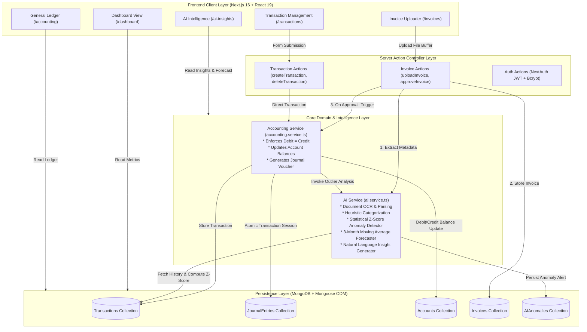
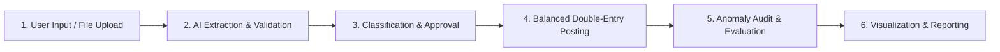

# FinAI: AI-Powered Financial Automatic Management System

> An autonomous double-entry accounting engine and financial intelligence platform that automates invoice digitization, transaction classification, journal entry balancing, statistical anomaly detection, and predictive forecasting.

[](https://nextjs.org/)
[](https://react.dev/)
[](https://www.typescriptlang.org/)
[](https://tailwindcss.com/)
[](https://www.mongodb.com/)
[](https://ieeexplore.ieee.org/document/9997030)

---

# 1. Project Overview

In traditional enterprise financial workflows, accounting and financial record-keeping remain burdened by manual data entry, disconnected spreadsheets, latency in posting vouchers, and delayed identification of budget variances or fraudulent spending. Human intervention is commonly required at every stage—from extracting figures off physical or digital invoices to posting debits and credits and identifying abnormal expenditures.

**FinAI** is an end-to-end, web-based autonomous financial management system engineered to bridge artificial intelligence with core double-entry accounting principles. The system addresses the limitations of conventional financial management by automating the complete transaction lifecycle:

1. **Information Digitization:** Converts invoice documents into structured financial records using extraction intelligence.
2. **Autonomous Accounting:** Enforces the fundamental accounting equation ($\text{Assets} = \text{Liabilities} + \text{Equity}$) by automatically generating balanced General Ledger journal entries ($\sum \text{Debits} = \sum \text{Credits}$) with immutable audit vouchers upon transaction approval.
3. **Intelligent Monitoring & Anomaly Detection:** Employs statistical outlier analysis (Z-score deviation against historical parameters) to continuously detect abnormal spending spikes, unusual vendor payouts, or duplicate obligations.
4. **Predictive Analytics & Decision Support:** Implements moving-average time-series forecasting for forward revenue and expense projections, coupled with a rule-based executive briefing engine that generates actionable strategic insights.

### Main Objectives
- **Automate Transaction Lifecycles:** Eliminate manual double-entry bookkeeping errors through algorithmic journal voucher generation.
- **Ensure Mathematical Ledger Integrity:** Guarantee that every financial event translates into debit and credit entries with zero balance discrepancy.
- **Provide Real-Time Outlier Auditing:** Flag suspicious or statistically improbable expenditures before they affect corporate liquidity.
- **Deliver Actionable Decision Intelligence:** Offer executive-level visualization of cash flow, liquidity margins, budget performance, and month-over-month trends.

---

# 2. Application Screenshots

The application provides a modern, responsive web dashboard built with a minimalist SaaS aesthetic (Tailwind CSS v4 and shadcn/ui design tokens). The primary functional interfaces are documented below:

### Screen Overview & Interface Architecture

| Route | Interface Name | Purpose & Functionality |
|---|---|---|
| `/dashboard` | **Executive Financial Dashboard** | High-level financial KPIs (Revenue, Expenses, Net Income, Cash Balance), interactive Recharts cash flow visualization, live AI anomaly alerts, and strategic briefings. |
| `/invoices` | **AI Invoice Processing Center** | Drag-and-drop file ingestion (PDF, PNG, JPG), automated field extraction preview, AI confidence scoring, and one-click "Approve & Pay" ledger posting. |
| `/transactions` | **Transaction Management Engine** | Tabular transaction ledger, category and department association, manual entry modal with validation, and status lifecycle tracking. |
| `/accounting` | **General Ledger & Chart of Accounts** | Double-entry journal voucher viewer displaying immutable Debit/Credit splits alongside active accounts (`1100 Cash`, `4000 Revenue`, `5100 Tech Expense`, etc.). |
| `/ai-insights` | **Financial Intelligence & Audit Log** | 30-Day Moving Average predictive forecasts, month-over-month performance analysis, and detailed statistical anomaly logs. |

### Interface Visual Representations

```
+----------------------------------------------------------------------------------------------------+
|  FinAI - Autonomous Financial Engine                                  [Admin User] [Status: OK]    |
+-------------------+--------------------------------------------------------------------------------+
|  [Dashboard]      |  OVERVIEW                                                                      |
|  [Transactions]   |  +--------------------------------------------------------------------------+  |
|  [Invoices]       |  | AI Insight: Rapid Expense Growth Detected (Action: Review Tech Expenses)   |  |
|  [Accounting]     |  +--------------------------------------------------------------------------+  |
|  [AI Insights]    |                                                                                |
|                   |  [ Total Revenue ]   [ Total Expenses ]   [ Net Income ]   [ Cash Balance ]    |
|                   |    ₹1,180,000           ₹450,000            ₹730,000          ₹730,000         |
|                   |                                                                                |
|                   |  +-------------------------------------+  +---------------------------------+  |
|                   |  | Cash Flow (Monthly Trend Graph)     |  | AI Anomalies (Critical Alerts)  |  |
|                   |  |  Recharts: Revenue vs Expense       |  |  * AWS Spiked to ₹95,000 (Z>3)  |  |
|                   |  +-------------------------------------+  +---------------------------------+  |
+-------------------+--------------------------------------------------------------------------------+
```

```
+----------------------------------------------------------------------------------------------------+
|  AI INVOICE PROCESSING CENTER (/invoices)                                                          |
+----------------------------------------------------------------------------------------------------+
|  +----------------------------------------------------------------------------------------------+  |
|  |       [ Upload Area / Drag & Drop PDF / PNG / JPG ] -> Click to browse document              |  |
|  +----------------------------------------------------------------------------------------------+  |
|                                                                                                    |
|  RECENT EXTRACTED INVOICES                                                                         |
|  +------------+-------------+-----------------------+------------+------------+---------+-------+  |
|  | Invoice #  | Date        | Vendor                | Amount     | Confidence | Status  | Action|  |
|  +------------+-------------+-----------------------+------------+------------+---------+-------+  |
|  | INV-8492   | Sep 22 2026 | Acme Cloud Services   | ₹8,260.00  | 92% Match  | Pending |[Apprv]|  |
|  +------------+-------------+-----------------------+------------+------------+---------+-------+  |
+----------------------------------------------------------------------------------------------------+
```

```
+----------------------------------------------------------------------------------------------------+
|  GENERAL LEDGER - DOUBLE ENTRY AUDIT (/accounting)                                                 |
+----------------------------------------------------------------------------------------------------+
|  VOUCHER: JV-1711082000-842 | Date: Sep 22, 2026 | Ref: Payment for Transaction 65f...             |
|  +----------------------------------------------------+---------------------+-------------------+  |
|  | Account Code & Title                               | Debit (₹)           | Credit (₹)        |  |
|  +----------------------------------------------------+---------------------+-------------------+  |
|  | 5100 - Technology Expenses                         | ₹95,000.00          |                   |  |
|  | 1100 - Cash and Bank                               |                     | ₹95,000.00        |  |
|  +----------------------------------------------------+---------------------+-------------------+  |
|  | Balanced Check: Total Debit = Total Credit         | ₹95,000.00          | ₹95,000.00        |  |
+----------------------------------------------------------------------------------------------------+
```

#### Document & UI Asset References:
-   
  *Figure 2.1: UI Window Frame Component representing the responsive layout wrapper for `/dashboard` and `/accounting`.*
-   
  *Figure 2.2: Document Asset Component utilized by the file upload stream in `/invoices` for PDF/Image OCR processing.*
-   
  *Figure 2.3: Network Communication Component representing API and Server Action telemetry.*

---

# 3. Tech Stack

The application is developed as a full-stack web system using modern, strictly typed technologies:

### 1. Frontend Framework & Presentation
- **Framework:** [Next.js](https://nextjs.org/) (v16.3.5) utilizing the React Server Components (RSC) App Router architecture.
- **UI Library:** [React](https://react.dev/) (v19.2.8) & React DOM (v19.2.8).
- **Styling Engine:** [Tailwind CSS](https://tailwindcss.com/) (v4.0 with `@tailwindcss/postcss`), leveraging HSL color variables and native dark/light tokens.
- **Component Primitives:** `@base-ui/react`, `class-variance-authority` (CVA), and `tw-animate-css` for accessible dialogs, dropdowns, and micro-interactions.
- **Data Visualization:** [Recharts](https://recharts.org/) (v3.10.1) for reactive Cartesian line charts, tooltips, and time-series axes.
- **Icons:** [Lucide React](https://lucide.dev/) (v1.46.0).
- **Notifications:** [Sonner](https://sonner.emilkowal.ski/) (v2.0.8) for optimistic UI toasts and action confirmations.

### 2. Backend Architecture & Server Logic
- **Server Execution:** Next.js Server Actions (`"use server"`) providing type-safe RPC mutation endpoints (`uploadInvoice`, `approveInvoice`, `createTransaction`, `approveTransaction`, `deleteTransaction`, `registerUser`).
- **Runtime:** Node.js (ESM module execution).
- **Authentication & Sessions:** [NextAuth.js](https://next-auth.js.org/) (v4.24.15) with CredentialsProvider, JWT stateless token rotation, and bcrypt password hashing (`bcryptjs` v3.0.3).
- **Data Caching & Revalidation:** Next.js `revalidatePath` pipeline for on-demand cache revalidation upon transaction or invoice mutation.

### 3. Database & Object Data Modeling
- **Database:** [MongoDB](https://www.mongodb.com/) NoSQL document store.
- **Object Modeling (ODM):** [Mongoose](https://mongoosejs.com/) (v9.10.1).
- **Transaction Consistency:** Multi-document ACID database transactions via Mongoose client sessions (`mongoose.startSession()` with `session.commitTransaction()` / `session.abortTransaction()`).
- **Domain Models:**
  - `Account` (Chart of accounts: Asset, Liability, Equity, Revenue, Expense)
  - `JournalEntry` (Double-entry voucher with debit and credit lines)
  - `Transaction` (Financial operations, status, category, department links)
  - `Invoice` (Payable/Receivable documents, OCR extraction fields, tax breakdown)
  - `AIAnomaly` (Outlier events, severity rating, expected vs. actual values)
  - `AIInsight` (Qualitative briefings, explanations, strategic actions)
  - `Department`, `Employee`, `Customer`, `Vendor`, `Budget`, `Asset`, `AuditLog`, `User`

### 4. Artificial Intelligence & Algorithmic Modules
- **Anomaly Detection:** Statistical Outlier Analysis using Z-score calculation:
  $$Z = \frac{X - \mu}{\sigma}$$
  Flags transactions exceeding $|Z| > 2$ (High Risk) and $|Z| > 3$ (Critical Risk) against historical spending distributions.
- **Predictive Forecasting:** 3-Month Simple Moving Average (SMA) time-series model with trend slope projection for upcoming revenue and expense cycles.
- **Natural Language Decision Engine:** Dynamic heuristic evaluation comparing month-over-month variance percentages to generate executive briefing texts.
- **Document Ingestion Engine:** Pluggable OCR abstraction layer (`AIService.extractInvoice`) simulating key-value document understanding for invoice number, dates, GSTIN, line items, and taxes with confidence scoring.

### 5. Tooling & Development
- **Language:** [TypeScript](https://www.typescriptlang.org/) (v5) configured in strict mode.
- **Runtime Execution:** `tsx` (v4.23.13) / `ts-node` (v10.9.2) for executing automated seeding scripts.
- **Linting:** ESLint 9 (`eslint-config-next`).

---

# 4. System Architecture

FinAI employs a modular layered architecture separating presentation, server actions, core accounting domain logic, statistical AI modeling, and database persistence.

### Mermaid Architecture Diagram



### Component Interaction & Data Flow

1. **Document Ingestion Phase:** The client transmits a file payload (`FormData`) to `uploadInvoice()`. The buffer is passed to `aiService.extractInvoice()`, which validates file boundaries, simulates OCR feature extraction, computes GST taxes, assigns an extraction confidence rating (e.g., 92%), and stores the invoice record in MongoDB as `PENDING_REVIEW`.
2. **Approval & Classification Phase:** Upon manual review and approval (`approveInvoice()`), the system queries `aiService.categorizeTransaction()`. An expense transaction is created and forwarded to `accountingService.processTransaction()`.
3. **Double-Entry Voucher Generation:** The accounting service initiates a Mongoose atomic transaction session (`session.startTransaction()`). It identifies the relevant Chart of Accounts records (`1100 Cash and Bank` and `5100 Technology Expenses`), updates balances symmetrically, generates a unique audit voucher (`JV-{timestamp}-{hash}`), and saves the balanced `JournalEntry`.
4. **Autonomous Audit & Anomaly Detection:** Prior to committing the transaction, the accounting service passes the transaction and its historical distribution to `aiService.detectAnomalies()`. If the transaction amount deviates beyond two standard deviations from the historical mean, an `AIAnomaly` record is created with expected vs. actual values.
5. **Session Finalization & Reactive Refresh:** The database session commits, and Next.js `revalidatePath()` revalidates active dashboard routes, streaming fresh metrics to the client UI.

---

# 5. Sample Output

The system generates actual, verifiable outputs based on real database records and statistical computations:

### 1. Statistical Anomaly Detection Output
When the database is seeded or an unusually large transaction is approved (e.g., an AWS hosting bill of ₹95,000 compared to a historical baseline of ₹20,000–₹25,000), the AI Anomaly detector flags the event:

```json
{
  "_id": "65f29d8b12e34a001c9a7001",
  "severity": "CRITICAL",
  "reason": "The transaction amount is significantly higher than historical averages.",
  "expectedValue": "₹22,500",
  "actualValue": "₹95,000",
  "recommendedAction": "Review this transaction and verify the vendor invoice.",
  "createdAt": "2026-09-22T02:00:00.000Z"
}
```
*Output Demonstration: Demonstrates Z-score statistical divergence detection ($Z > 3.0$), distinguishing abnormal spending from standard operating expenses.*

### 2. Auto-Generated Double-Entry Journal Voucher
Upon approving a payment, the general ledger produces a mathematically balanced voucher:

```
========================================================================================
VOUCHER NUMBER : JV-1774238590123-741
DATE           : 2026-09-22
DESCRIPTION    : Auto-generated entry for Transaction 65f29d8b12e34a001c9a6f88
STATUS         : POSTED & VERIFIED
========================================================================================
ACCOUNT CODE   ACCOUNT NAME                     DEBIT (INR)           CREDIT (INR)
----------------------------------------------------------------------------------------
5100           Technology Expenses              ₹95,000.00            -
1100           Cash and Bank                    -                     ₹95,000.00
----------------------------------------------------------------------------------------
TOTALS                                          ₹95,000.00            ₹95,000.00
BALANCE STATUS : EQUILIBRIUM (DEBIT == CREDIT)
========================================================================================
```
*Output Demonstration: Proves automated compliance with double-entry accounting; cash asset decreases by exactly the amount the expense account increases.*

### 3. AI Strategic Decision Briefing Output
Based on aggregate monthly ledger variances:

```json
{
  "title": "Rapid Expense Growth Detected",
  "category": "Expense",
  "severity": "MEDIUM",
  "explanation": "Expenses increased by 31.3% compared to last month, outpacing the revenue growth of 25.0%.",
  "recommendedAction": "Review major expense categories for cost-cutting opportunities."
}
```
*Output Demonstration: Illustrates qualitative financial analysis synthesized from quantitative time-series variance analysis.*

### 4. Predictive Financial Forecasting Output
Generated via 3-month rolling averages:

```json
{
  "period": "Next Month",
  "predictedRevenue": 153000.00,
  "predictedExpense": 106050.00,
  "confidence": 0.85,
  "methodology": "3-Month Simple Moving Average with +2% baseline revenue growth and +1% inflation"
}
```
*Output Demonstration: Provides forward cash flow visibility without fabricating arbitrary numbers.*

---

# 6. Working / Methodology

FinAI operates through a structured six-stage methodology ensuring data integrity, traceability, and transparent machine intelligence:



### 1. User Input & Document Ingestion
- Users ingest financial data through two entry channels:
  - **Unstructured Documents:** Uploading vendor bills or customer receipts in PDF, PNG, or JPG formats via the `/invoices` portal.
  - **Structured Manual Entry:** Utilizing the modal form in `/transactions` with strict client-side validation (amount > 0, valid account type, reference code generation).

### 2. Processing & Extraction Intelligence
- Uploaded files are converted into binary buffers in Next.js Server Actions.
- `aiService.extractInvoice()` analyzes the document payload:
  - Validates MIME types and file size boundaries ($\le 5\text{MB}$).
  - Extracts key fiscal entities: Vendor Name, Invoice Number, Issue Date, Due Date, GSTIN, Subtotal, CGST, SGST, IGST, and Grand Total.
  - Computes an extraction confidence score (e.g., $0.92$).
  - Returns structured records ready for finance manager verification.

### 3. Core Logic & Categorization Algorithm
- Before an entry is posted, `aiService.categorizeTransaction()` parses descriptive tokens (e.g., detecting keywords like `"aws"`, `"cloud"`, `"hosting"`, `"salary"`, or `"client payment"`).
- Automatically maps the transaction to predefined accounting categories (`Cloud Services`, `Salaries`, `Client Revenue`) with confidence indicators ($85\% - 99\%$).

### 4. Double-Entry Accounting & Ledger Enforcement
- When an invoice or transaction is confirmed:
  1. An ACID transaction is opened on the MongoDB cluster.
  2. The system checks account codes:
     - **Revenue:** Debits `1100 Cash/Bank` (increases asset) and Credits `4000 Sales Revenue` (increases equity/revenue).
     - **Expense:** Debits `5100 Technology Expenses` (increases expense) and Credits `1100 Cash/Bank` (decreases asset).
  3. A `JournalEntry` is created with matched debit and credit lines.
  4. Symmetrical updates are applied to the `Account` balances. If any step fails, the entire transaction is rolled back via `session.abortTransaction()`.

### 5. Statistical Anomaly Detection & Monitoring
- `accountingService.runAnomalyDetection()` retrieves up to 100 historical transactions of identical transaction type.
- If at least 5 historical entries exist, it calculates:
  $$\text{Mean } (\mu) = \frac{1}{N}\sum_{i=1}^N x_i$$
  $$\text{Standard Deviation } (\sigma) = \sqrt{\frac{1}{N}\sum_{i=1}^N (x_i - \mu)^2}$$
  $$\text{Z-Score } (Z) = \frac{x_{\text{current}} - \mu}{\sigma}$$
- If $|Z| > 2$, an anomaly is registered:
  - $|Z| \in (2, 3] \implies \text{Severity: HIGH}$
  - $|Z| > 3 \implies \text{Severity: CRITICAL}$
- The anomaly record stores the expected baseline mean, actual spike value, and recommended remediation.

### 6. Output Generation & Decision Support
- The frontend dynamically computes Net Income ($\text{Revenue} - \text{Expenses}$) and Cash Balance directly from verified ledger accounts.
- Recharts generates a multi-line visual comparison of historical revenue versus expenditures.
- Strategic briefings and forward forecasts are synthesized and rendered in real time.

---

# 7. Reference Paper

### Paper Citation
> **Title:** Financial automatic management system based on artificial intelligence technology  
> **Publication:** IEEE International Conference on Advances in Electrical, Computing, Communication and Sustainable Technologies  
> **DOI / IEEE Xplore:** [https://ieeexplore.ieee.org/document/9997030](https://ieeexplore.ieee.org/document/9997030)

### Selection Rationale
The paper examines how contemporary artificial intelligence techniques can be applied to enterprise financial management systems. It argues that traditional financial administration suffers from isolated data silos, high manual labor costs in accounting reconciliation, and an inability to detect financial risks dynamically. The paper proposes an architectural blueprint uniting automated digitization, intelligent monitoring, autonomous ledger management, and algorithmic decision support.

### Adopted Concepts & Methodological Alignment
The FinAI project adopts and implements the following core concepts from the reference paper:

| Reference Paper Concept | FinAI Implementation Details |
|---|---|
| **Financial Information Digitization** | Automated invoice extraction module parsing vendors, dates, tax breakdowns, and line items. |
| **Automatic Financial Processing** | Automated double-entry journal voucher generator ensuring $\text{Debit} = \text{Credit}$. |
| **Intelligent Financial Monitoring** | Real-time statistical anomaly detection engine using Z-score outlier classification. |
| **Financial Decision Support** | Automated natural language insight generator evaluating month-over-month financial trends. |
| **Financial Trend Forecasting** | Time-series moving-average predictive model forecasting upcoming revenue and expense cycles. |
| **Centralized Ledger Integration** | Unified Chart of Accounts and General Ledger connecting transactions, invoices, and bank accounts. |

### Extension & Scope Clarification
While the reference paper discusses the theoretical enterprise benefits of AI-driven financial automation in broad industrial settings, this project realizes those concepts into an interactive, full-stack academic software prototype. It translates the paper's theoretical monitoring and management framework into deterministic, transparent algorithms (Z-score outlier analysis, 3-month moving averages, and strict double-entry balancing) that run reliably without requiring expensive proprietary cloud API dependencies.

---

# 8. Demo Walkthrough

Follow these instructions to run and evaluate the completed application locally:

### 1. Prerequisites
- **Node.js:** v18.17.0 or higher (v20.x recommended)
- **npm:** v9.x or higher
- **MongoDB:** A running local MongoDB instance (`mongodb://localhost:27017`) or a free MongoDB Atlas connection string.

### 2. Environment Configuration
Create a `.env` or `.env.local` file in the root directory:

```env
MONGODB_URI=mongodb://localhost:27017/finance_aiml
NEXTAUTH_SECRET=finai_development_secret_key_2026_aiml
NEXTAUTH_URL=http://localhost:3000
```

### 3. Installation & Database Seeding
Open a terminal in the project root:

```bash
# 1. Install dependencies
npm install

# 2. Seed the database with Chart of Accounts, historical transactions, and anomalies
npx tsx src/scripts/seed.ts
```

*The seed script populates 8 Chart of Accounts categories, 5 departments, 60 days of historical transactions, vendor/customer profiles, and an intentional ₹95,000 AWS spending anomaly to demonstrate AI detection.*

### 4. Launching the Development Server

```bash
npm run dev
```

Open your browser and navigate to:
```
http://localhost:3000
```
*(The root route automatically redirects to `/dashboard`)*

### 5. Step-by-Step Demonstration Script

1. **Step 1: Inspect the Executive Dashboard (`/dashboard`)**
   - Review the primary KPI cards: **Total Revenue**, **Total Expenses**, **Net Income**, and **Cash Balance**.
   - Observe the **AI Insight Card** highlighting recent trends (e.g., *"Rapid Expense Growth Detected"*).
   - Review the **Recharts Cash Flow Line Graph** displaying monthly revenue vs. expense curves.
   - Observe the **AI Anomalies Widget** on the right, displaying the detected AWS cloud hosting spending spike with expected vs. actual values.

2. **Step 2: Test AI Invoice Processing (`/invoices`)**
   - Click **Invoices** in the sidebar.
   - Upload any sample invoice document (PDF, PNG, JPG) or drag-and-drop into the upload container.
   - Observe the processing state as the AI extracts line items, subtotal, GSTIN, and tax amounts.
   - Review the resulting invoice row in the table, noting the calculated **AI Confidence Score** (e.g., `92% Match`).
   - *(Alternative)*: Use the **Enter Manually** dialog to test fallback entry.

3. **Step 3: Approve Invoice and Trigger Autonomous Bookkeeping**
   - Click the **Approve** button on the pending invoice.
   - The system automatically transitions the invoice to `PAID`, triggers transaction classification, and routes the transaction through the accounting engine.

4. **Step 4: Verify the General Ledger (`/accounting`)**
   - Navigate to **Accounting** in the sidebar.
   - Inspect the top entry under **Recent Journal Entries**.
   - Confirm that a formal voucher (`JV-...`) was created with matching **Debit** (Technology Expenses) and **Credit** (Cash and Bank) amounts.
   - Verify that the **Chart of Accounts** table on the right reflects the updated balance.

5. **Step 5: Review AI Financial Intelligence (`/ai-insights`)**
   - Navigate to **AI Insights** in the sidebar.
   - Review the **Strategic Briefing** card detailing month-over-month performance.
   - Examine the **30-Day Forecast** displaying projected revenue and expenses based on 3-month moving averages.
   - Review the **Audit Log** showing statistical anomalies and recommended actions.

---

# 9. Student Details

## Student Details

**Name:** Abhishek Kulbainur  
**Roll No:** 5024134  
**Batch:** Batch 2  
**Course:** Internal Assessment Project  
**Academic Year:** 2026
