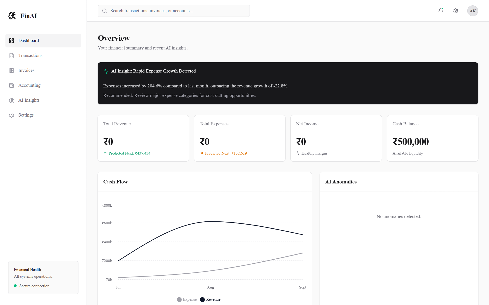
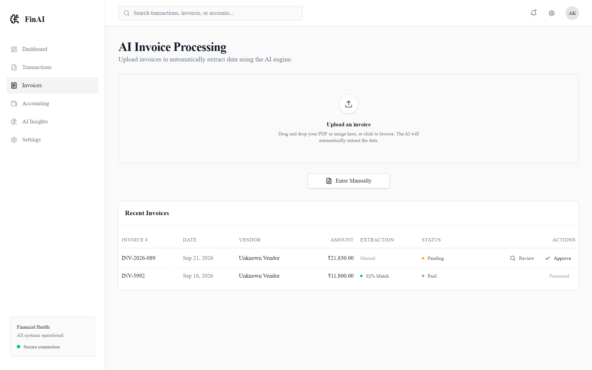
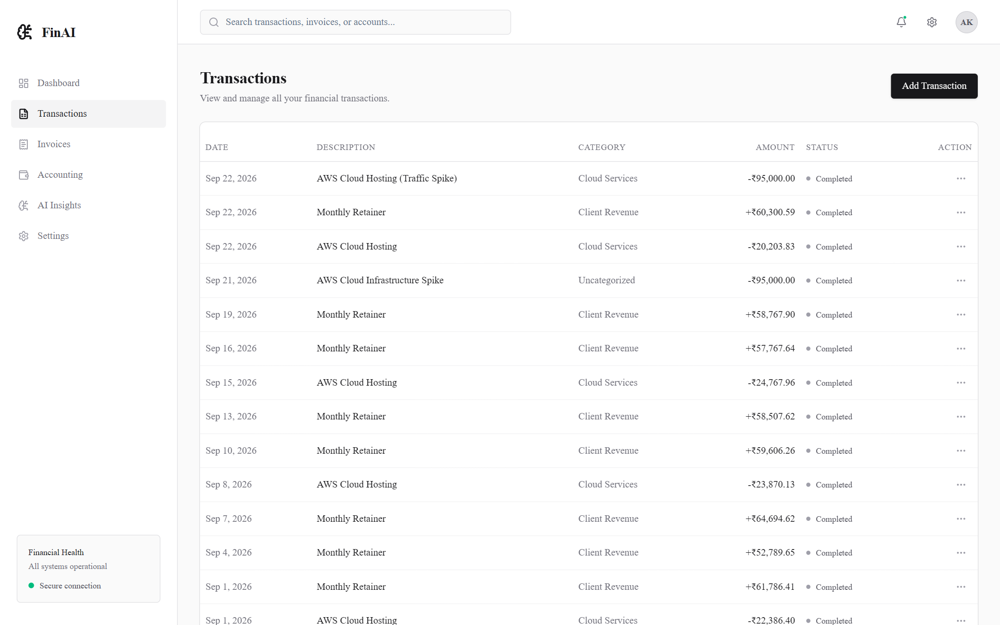
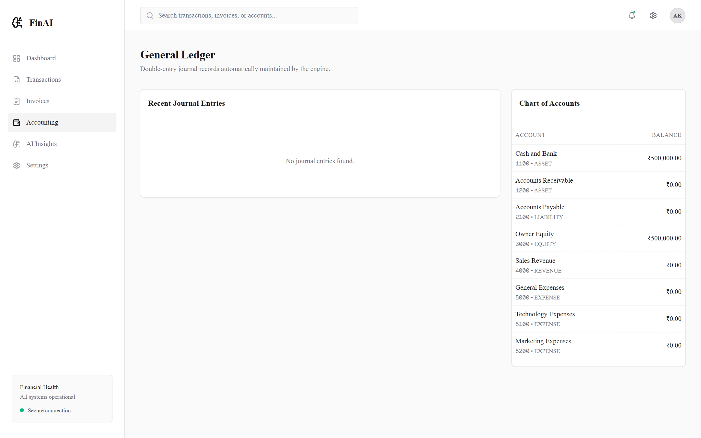
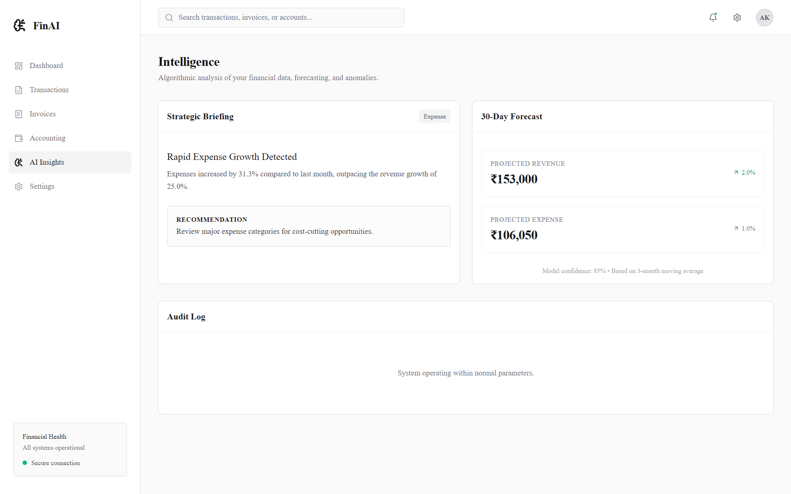
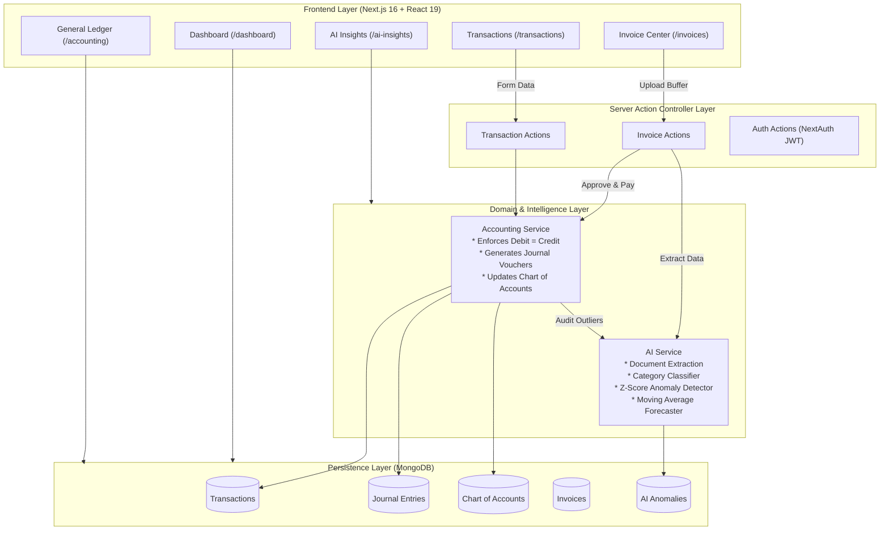
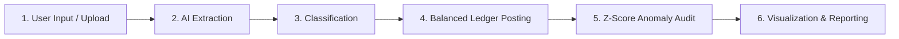

# FinAI: AI-Powered Financial Automatic Management System

> An autonomous double-entry accounting engine and financial intelligence platform that automates invoice digitization, transaction classification, journal entry balancing, statistical anomaly detection, and predictive forecasting.

[](https://nextjs.org/)
[](https://react.dev/)
[](https://www.typescriptlang.org/)
[](https://www.java.com/)
[](https://tailwindcss.com/)
[](https://www.mongodb.com/)
[](https://ieeexplore.ieee.org/document/9997030)

---

# 1. Project Overview

Traditional enterprise bookkeeping is hindered by manual data entry, human error in ledger posting, delayed discovery of spending spikes, and lack of real-time predictive insights.

**FinAI** is a web-based autonomous financial management system that bridges artificial intelligence with core double-entry accounting principles ($\text{Assets} = \text{Liabilities} + \text{Equity}$). The system automates the end-to-end transaction pipeline:

- **Information Digitization:** Ingests invoice documents and extracts structured fiscal parameters.
- **Autonomous Double-Entry Accounting:** Enforces mathematical ledger balance ($\sum \text{Debits} = \sum \text{Credits}$) with immutable audit vouchers upon transaction approval.
- **Intelligent Monitoring & Anomaly Detection:** Applies statistical Z-score outlier detection to flag irregular spending spikes.
- **Predictive Decision Support:** Utilizes moving-average time-series forecasting for upcoming revenue and expense cycles, alongside executive briefings.

---

# 2. Application Screenshots

### Screen Overview

| Route | Interface Name | Purpose & Functionality |
|---|---|---|
| `/dashboard` | **Executive Dashboard** | Real-time KPIs (Revenue, Expense, Net Income, Cash), Recharts cash flow trends, and AI alert widgets. |
| `/invoices` | **AI Invoice Processing** | Document upload (PDF/Images), automated OCR extraction preview, confidence scores, and one-click approval. |
| `/transactions` | **Transaction Management** | Tabular transaction ledger, category assignment, manual entry modal, and status tracking. |
| `/accounting` | **General Ledger** | Double-entry journal vouchers with balanced Debit/Credit splits and live Chart of Accounts balances. |
| `/ai-insights` | **AI Insights & Audit** | 30-Day Moving Average forecasts, executive briefings, and statistical anomaly logs. |

---

### Application Screen Showcase

### Dashboard

*Displays primary financial KPIs, active Cash Balance (₹500,000), monthly Cash Flow Recharts curve, and AI Strategic Insight banners.*

---

### AI Invoice Processing

*Features drag-and-drop document ingestion, automated extraction confidence rating (e.g., 92% Match), and one-click review/approval actions.*

---

### Transaction Management

*Shows the searchable transaction ledger, income/expense classifications, and modal for adding new transactions with instant server validation.*

---

### Accounting / General Ledger

*Presents the Chart of Accounts (`1100 Cash`, `4000 Revenue`, `5100 Tech Expense`) and automated balanced journal entry vouchers.*

---

### AI Insights & Audit

*Provides a 30-Day Moving Average forecast (Revenue: ₹153k, Expense: ₹106k at 85% confidence), executive briefing, and statistical audit log.*

---

# 3. Tech Stack

| Category | Technologies |
|---|---|
| **Frontend** | [Next.js 16](https://nextjs.org/) (App Router), [React 19](https://react.dev/), [Tailwind CSS v4](https://tailwindcss.com/), [shadcn/ui](https://ui.shadcn.com/), [Recharts 3](https://recharts.org/), [Lucide React](https://lucide.dev/), [Sonner](https://sonner.emilkowal.ski/) |
| **Backend** | Next.js Server Actions (`"use server"`), Node.js, [NextAuth.js](https://next-auth.js.org/) (JWT sessions), [Bcryptjs](https://www.npmjs.com/package/bcryptjs) |
| **Database** | [MongoDB](https://www.mongodb.com/) with [Mongoose 9](https://mongoosejs.com/) (Atomic transaction sessions, full relation modeling) |
| **AI / Statistics** | Z-Score Anomaly Outlier Detection ($Z = \frac{X - \mu}{\sigma}$), 3-Month Simple Moving Average (SMA) Forecasting, Rule-based Categorization, Document Extraction Abstraction |
| **Tools & Language** | TypeScript 5 (Strict mode), TSX/TS-Node, ESLint 9 |

---

# 4. System Architecture



### Data Flow
1. **Ingestion:** File uploaded via `/invoices` $\rightarrow$ `aiService.extractInvoice()` parses fields and assigns confidence score.
2. **Approval & Posting:** User clicks **Approve** $\rightarrow$ `accountingService.processTransaction()` executes an atomic session.
3. **Double-Entry Equilibrium:** Account balances update symmetrically; an immutable journal voucher (`JV-...`) is recorded where $\text{Debit} = \text{Credit}$.
4. **Statistical Audit:** `aiService.detectAnomalies()` compares amounts against historical mean ($\mu$) and standard deviation ($\sigma$). If $|Z| > 2$, an anomaly alert is saved.

---

# 5. Sample Output

### 1. Statistical Anomaly Detection Alert
```json
{
  "severity": "CRITICAL",
  "reason": "The transaction amount is significantly higher than historical averages.",
  "expectedValue": "₹22,500",
  "actualValue": "₹95,000",
  "recommendedAction": "Review this transaction and verify the vendor invoice."
}
```

### 2. Auto-Generated Double-Entry Journal Voucher
```text
VOUCHER NUMBER : JV-1774238590123-741 | Date: Sep 22, 2026
---------------------------------------------------------------------
Account Code & Title                     Debit (₹)         Credit (₹)
---------------------------------------------------------------------
5100 - Technology Expenses               ₹95,000.00        -
1100 - Cash and Bank                     -                 ₹95,000.00
---------------------------------------------------------------------
Total Balanced Check:                    ₹95,000.00        ₹95,000.00
Status: EQUILIBRIUM (Debit == Credit)
```

### 3. Predictive Forecast Output
```json
{
  "period": "Next Month",
  "predictedRevenue": 153000.00,
  "predictedExpense": 106050.00,
  "confidence": 0.85,
  "method": "3-Month Simple Moving Average (SMA)"
}
```

---

# 6. Working / Methodology



1. **User Input:** Invoice documents (PDF/images) or manual transactions are submitted through secure client interfaces.
2. **Processing & OCR:** The system validates MIME types and buffers, extracting core invoice metadata (vendor, dates, GSTIN, line items, taxes).
3. **Classification:** Rule-assisted and heuristic classifiers determine account categories (`Cloud Services`, `Client Revenue`) with confidence ratings.
4. **Balanced Posting:** Atomic database transactions record debit and credit splits, ensuring ledger integrity.
5. **Statistical Auditing:** Outlier detection calculates $Z = (X - \mu)/\sigma$. Scores $|Z| > 2$ flag `HIGH` risk; $|Z| > 3$ flag `CRITICAL` anomalies.
6. **Reporting:** Aggregated metrics feed reactive charts, executive briefs, and forecasts.

---

# 7. Reference Paper

- **Title:** *Financial automatic management system based on artificial intelligence technology*
- **Publication:** IEEE International Conference on Advances in Electrical, Computing, Communication and Sustainable Technologies
- **IEEE Xplore:** [https://ieeexplore.ieee.org/document/9997030](https://ieeexplore.ieee.org/document/9997030)

### Alignment & Application
- **Selected Rationale:** Explores AI-driven digitization and risk monitoring to overcome manual bookkeeping bottlenecks in enterprise finance.
- **Concepts Implemented:** Information digitization (invoice parsing), autonomous double-entry journal vouchers, intelligent monitoring (Z-score anomaly detection), and moving-average financial forecasting.
- **Scope Note:** This project is an academic prototype implementing the paper's core architecture and methodology using modern web technologies.

---

# 8. Demo Walkthrough

### 1. Prerequisites
- **Node.js:** v18.17+ or v20+
- **MongoDB:** Local MongoDB instance (`mongodb://localhost:27017`) or Atlas connection string

### 2. Setup & Execution
```bash
# 1. Install dependencies
npm install

# 2. Configure environment in .env
MONGODB_URI=mongodb://localhost:27017/finance_aiml
NEXTAUTH_SECRET=finai_secret_key_2026
NEXTAUTH_URL=http://localhost:3000

# 3. Seed database with Chart of Accounts and sample transactions
npx tsx src/scripts/seed.ts

# 4. Start development server
npm run dev
```
Open **http://localhost:3000** in your browser.

### 3. Demonstration Flow
1. **Overview (`/dashboard`):** Inspect KPIs, cash balance, Recharts cash flow trend, and AI alert banner.
2. **Invoice Ingestion (`/invoices`):** Upload an invoice or use manual entry; inspect the extraction confidence score.
3. **Approve & Post:** Click **Approve** on a pending invoice to trigger automatic categorization and voucher posting.
4. **General Ledger (`/accounting`):** Verify the newly generated balanced Debit/Credit journal entry and updated Chart of Accounts.
5. **AI Insights (`/ai-insights`):** Review the 30-day forecast, strategic executive briefing, and anomaly audit log.

---

# 9. Student Details

## Student Details

**Name:** Abhishek Kulbainur  
**Roll No:** 5024134  
**Batch:** Batch 2  
**Course:** Internal Assessment Project  
**Academic Year:** 2026

---

<p align="center">
  <b>Developed by Abhishek Kulbainur</b>
</p>

